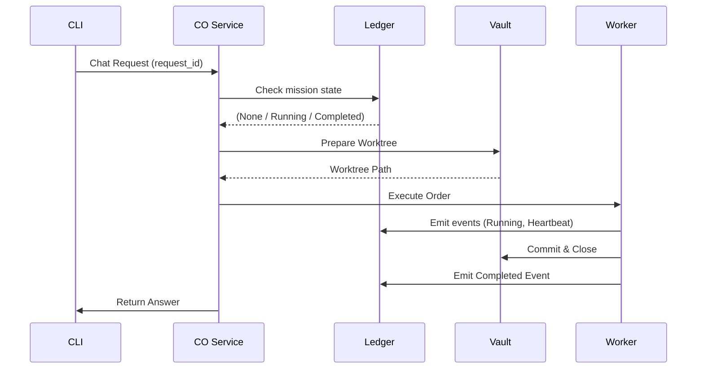

# IronClaw v1 — Absolute Mission Integrity

IronClaw is a microservices-based framework designed for the robust, idempotent, and verifiable execution of automated missions. It enforces strict separation of concerns to ensure that every mission is logged as the source of truth, protected from redundant execution, and verifiable via cryptographic or filesystem artifacts.

## What IronClaw Does
IronClaw provides an infrastructure to "fire and forget" missions. Once a mission objective is submitted via the CLI, the system handles the entire lifecycle:
- **Orchestration**: Automatically prepares environments and manages the hand-off between storage and execution.
- **Idempotency**: Prevents duplicate work. If you ask for the same mission twice, you get the same result (often instantly if already completed) without redundant processing.
- **Immutable Audit**: Records every state transition in an append-only ledger.
- **Theater Oversight**: Passively monitors active missions for stalls or integrity failures, alerting operators to anomalies.

## How It Works
The system follows a "Watchdog Chain" architecture across five core microservices:

1. **CLI (`ironclaw`)**: The human interface. It generates a unique `request_id` and submits it to the CO.
2. **CO (Command & Oversight)**: The brain. It checks the Ledger to see if the mission exists. If not, it requests a worktree from the Vault and sends it to the Worker.
3. **Vault**: The quartermaster. It manages ephemeral Git worktrees for each mission and handles long-term archival of completed mission data.
4. **Worker**: The muscle. It takes a worktree, executes the required logic, commits changes, and writes an After Action Report (`aar.json`).
5. **Ledger**: The scribe. An append-only store of every event. It is the definitive source of truth for the entire system's state.
6. **Observer**: The lookout. A persistent background service that scans the Ledger and Filesystem to detect stalled runs or orphan directories.

### The Interaction Loop


## Directory Structure (Full v1 Tree)

```text
ironclaw/
├── .gitignore                      # Standard exclusions
├── README.md                       # Portfolio overview and executive summary
├── docs/                           # Formal specifications and design docs
│   ├── IronClaw_v1.md              # Authoritative v1 Specification
│   ├── IronClaw_v1_Design.md       # [This file] Design and architectural rationale
│   ├── IronClaw_task_list_mvp.md   # Original MVP task list
│   ├── contracts.pdf               # Project contracts
│   ├── Section-1-Overview.md       # Architectural overview
│   ├── Section-2_Role_Taxonomy_and_Watchdog_Chain.md
│   ├── Section-3_Assault_Units_and_Observers.md
│   ├── Section-4_The_Interaction_Loop.md
│   ├── Section-5_Mission_Planning_and_METE.md
│   ├── Section-6_Unit_Lifecycle_and_Decommissioning.md
│   ├── Section-7_Configuration_and_State.md
│   ├── Section-8_Extensibility & Playbooks.md
│   ├── Section-9_The_Operational_Ledger_and_Artifact_Management.md
│   └── Section-10_Glossary_and_Operational_Guarantees.md
├── garrison/                       # Service implementations (The "Garrison")
│   ├── cli/                        # Human Interface & Stack Control
│   │   ├── ironclaw.py             # Main CLI (chat, stack commands)
│   │   ├── README.md               # CLI basic usage
│   │   └── README_STACK.md         # Stack operator guide
│   ├── co_service/                 # Command & Oversight (Orchestration)
│   │   ├── main.py                 # API Implementation
│   │   ├── logic.py                # Orchestration workflows
│   │   ├── models.py               # Pydantic models
│   │   └── README.md
│   ├── ledger_service/             # The Source of Truth (Event Store)
│   │   ├── main.py                 # API handles
│   │   ├── database.py             # SQLite & Snapshot logic
│   │   ├── models.py               # Event schemas
│   │   ├── ingest_jsonl.py         # Data migration tool
│   │   └── README.md
│   ├── vault_service/              # Storage & Artifact Management
│   │   ├── main.py                 # API handles
│   │   ├── manager.py              # Git Worktree logic
│   │   ├── models.py               # Path validations
│   │   └── README.md
│   ├── worker_service/             # Mission Execution Engine
│   │   ├── main.py                 # API handles
│   │   ├── runner.py               # Unit execution logic
│   │   ├── models.py               # Execution schemas
│   │   └── README.md
│   └── observer_service/           # Passive Oversight & Signaling
│       ├── main.py                 # API & Background loop
│       ├── monitor.py              # Stall & integrity detection
│       ├── signals.py              # Alert deduplication & emission
│       └── README.md
├── theaters/                       # Deployment environments
│   └── demo/                       # Default demonstration theater
│       ├── repo/                   # Seed repository for mission worktrees
│       ├── worktrees/              # Ephemeral active mission environments
│       ├── archive/                # Tarballed completed missions
│       ├── schemas/                # AAR and Order validation schemas
│       ├── policy.json             # Theater-level safety policy
│       └── .env                    # Theater-specific environment config
└── tools/                          # Verification & smoke tests
    ├── smoke_phaseG_stack.sh       # Full E2E system smoke test
    ├── smoke_phaseF_observer.sh    # Observer detection test
    ├── smoke_phaseE_cli.sh         # CLI client test
    ├── co_smoke_test.py            # CO orchestration test
    ├── worker_smoke_test.py        # Worker execution test
    └── vault_smoke_test.py         # Vault worktree test
```

## Core v1 Operational Commands

### 1. Unified Stack Management
Start the entire ecosystem:
```bash
./garrison/cli/ironclaw.py stack up
```

Check what's running:
```bash
./garrison/cli/ironclaw.py stack status
```

### 2. Running a Mission
Submit a new mission:
```bash
./garrison/cli/ironclaw.py chat "Explain the current system status." --new
```

Retry if interrupted (idempotency in action):
```bash
./garrison/cli/ironclaw.py chat --retry
```

### 3. Monitoring
Tail all service logs with prefixes:
```bash
./garrison/cli/ironclaw.py stack logs -f
```

## Operational Safety
- **State Root**: All runtime state and logs are persisted to `~/.ironclaw/`.
- **Doctrine**: "Detect, Verify, Escalate. Never Execute." The system is designed to fail safe and transparently rather than guessing at recovery.

---
*IronClaw v1 | Declared Stable 2026-01-15*
