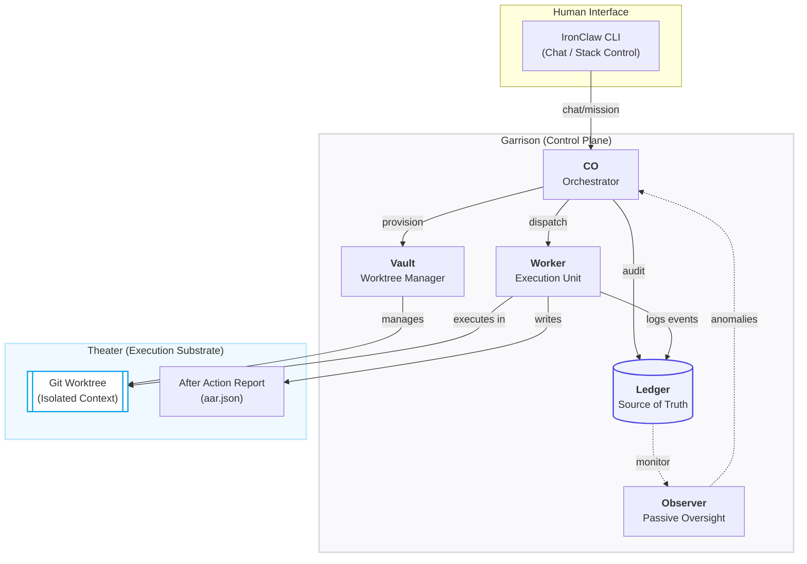
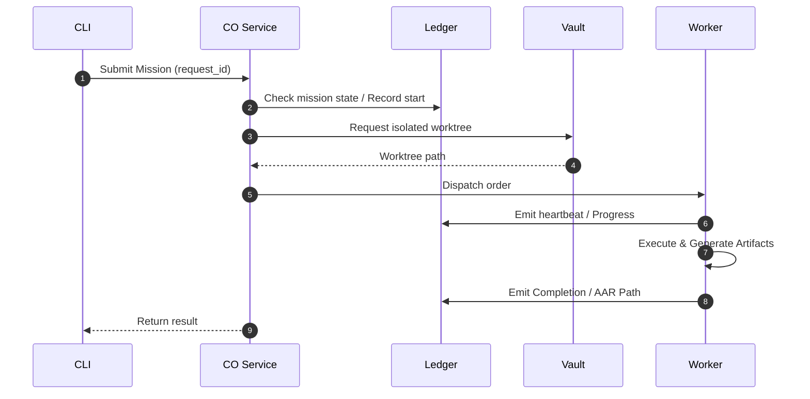

# IronClaw

*IronClaw is a Python-based mission execution and orchestration framework for durable, auditable AI runs in local or self-hosted environments.*

IronClaw is intended for engineers exploring reliable, self-hosted AI execution systems rather than hosted agent platforms.

It is built around a simple premise:

> **Execution units are disposable.**  
> **Mission state is permanent.**

IronClaw enforces this by combining an append-only event ledger, Git-backed worktrees, and strictly stateless execution units.

---

## Architecture overview

IronClaw follows a **Watchdog Chain** architecture, ensuring every action is recorded, every environment is isolated, and every failure is inspectable.

### System Flow


### The Mission Loop (Temporal View)


### Component Reference
| Service | Domain | Responsibility | Source of Truth |
| :--- | :--- | :--- | :--- |
| **Ledger** | Persistence | Append-only event store for mission lifecycle. | SQLite / JSONL |
| **Vault** | Storage | Managing Git worktrees, isolation, and archival. | Filesystem / Git |
| **Worker** | Execution | Stateless mission runner with artifact generation. | AAR (aar.json) |
| **CO** | Orchestration| High-level planning and service dispatch. | Ledger Events |
| **Observer**| Oversight | Monitoring for stalls, orphans, and policy violations. | Signaling Buffer (in-memory / ephemeral)|

---

## Quickstart (demo theater)

Run IronClaw locally using the included demo theater:

```bash
cd garrison/cli
python3 ironclaw.py stack up
python3 ironclaw.py chat "Hello IronClaw"
```

This will:
1. Start the full local service stack
2. Submit a mission
3. Execute it in an isolated Git worktree
4. Persist artifacts and lifecycle events

---

## Learn more

- **Spec** — [IronClaw_v1.md](IronClaw_v1.md)
- **Design deep dive** — [IronClaw_v1_Design.md](IronClaw_v1_Design.md)
- **GitHub repository** — [TLoveOps1/ironclaw](https://github.com/TLoveOps1/ironclaw)
- **Release notes** — [GitHub Release v1.1](https://github.com/TLoveOps1/ironclaw/releases/tag/v1.1)

IronClaw prioritizes correctness, auditability, and operator control over raw throughput or autonomy.
